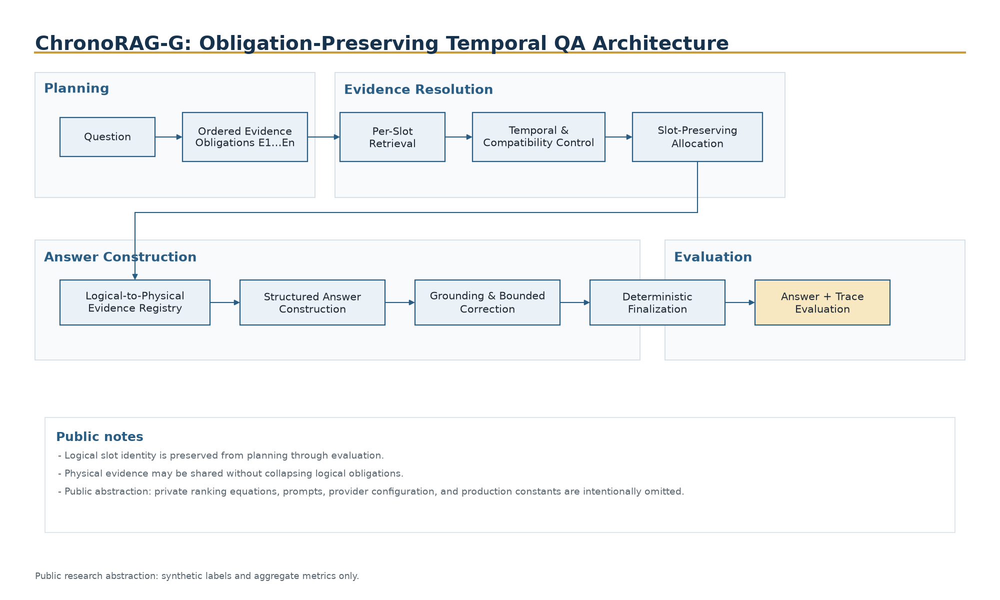
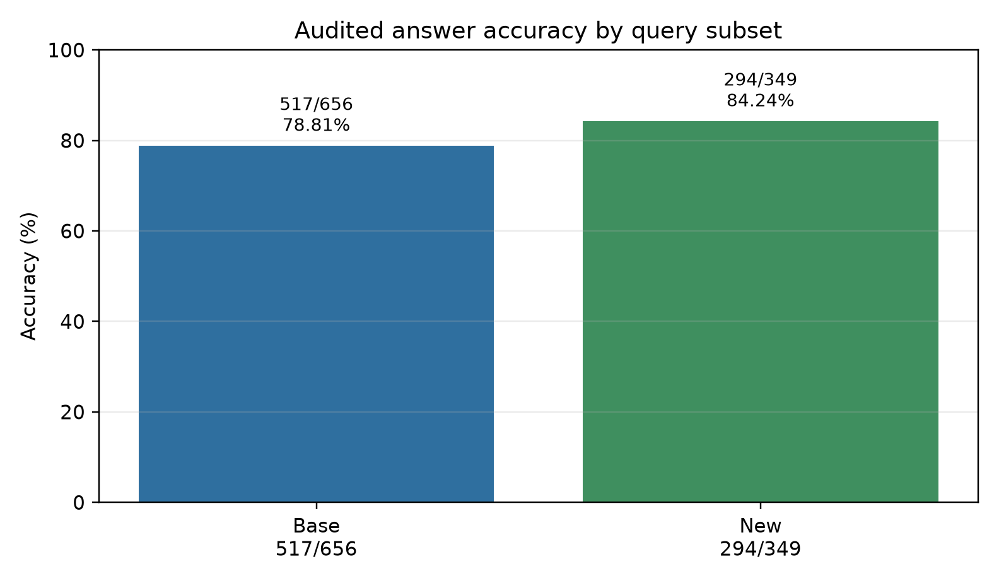
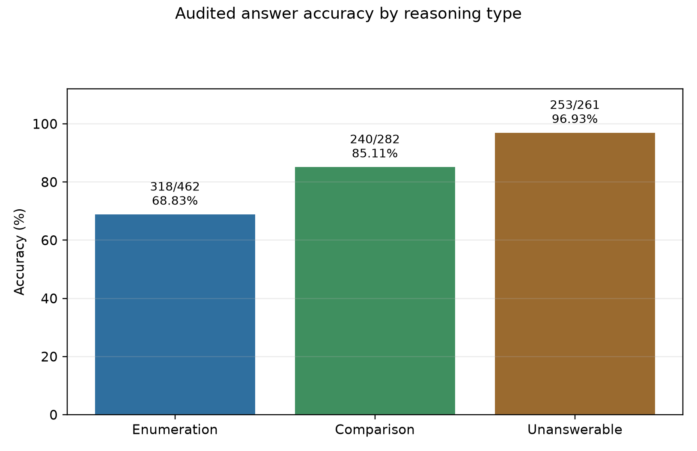
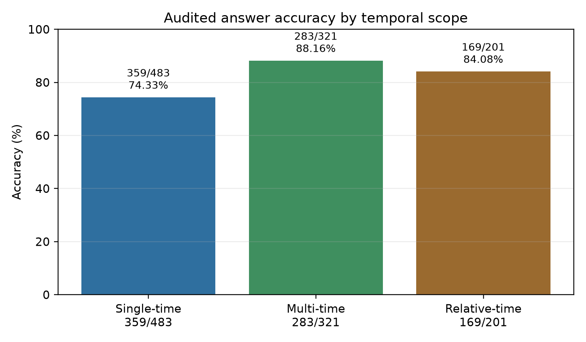
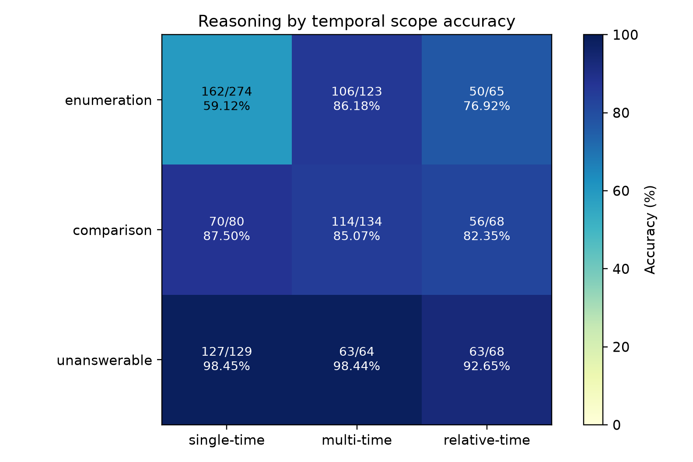
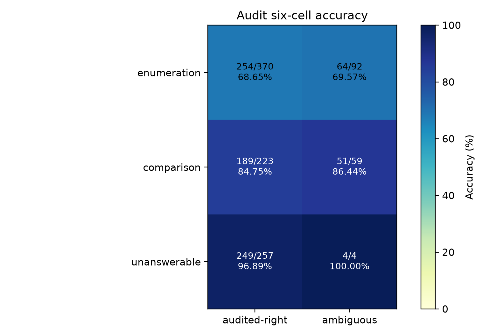
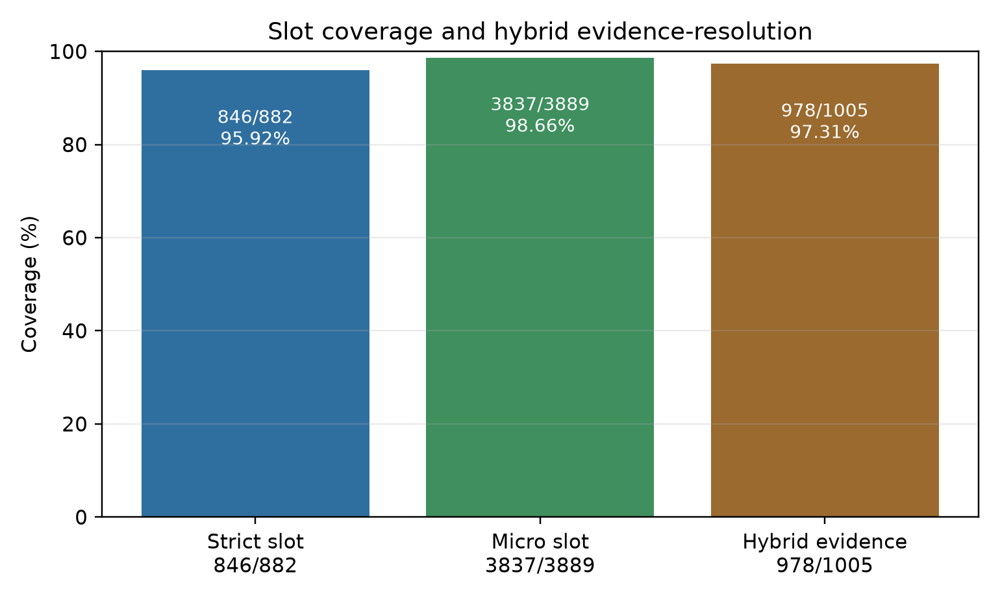
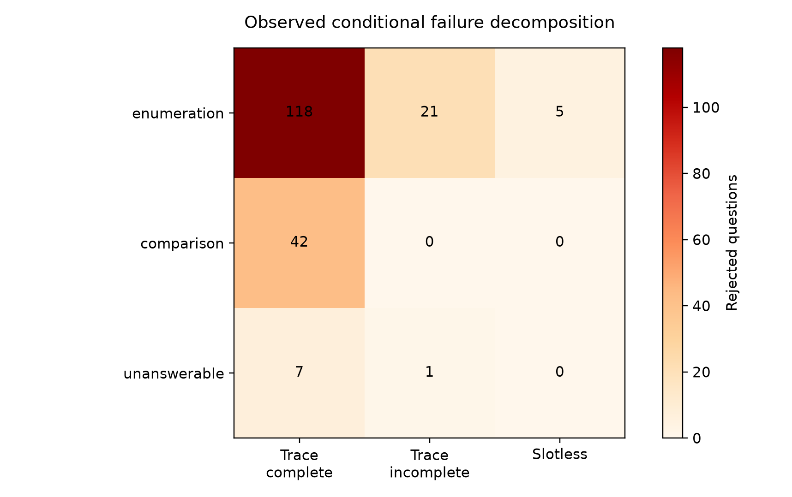
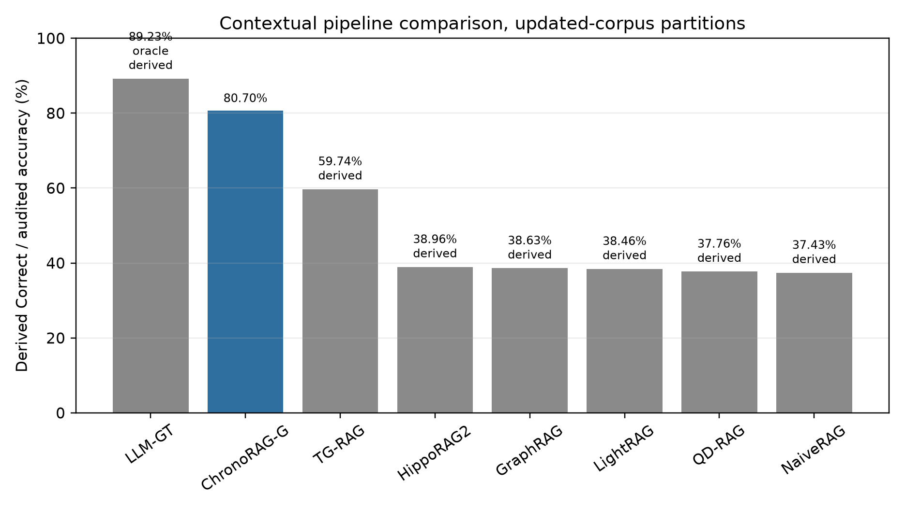

# ChronoRAG-G

**ChronoRAG-G is a temporal evidence-obligation architecture for answering multi-entity, multi-metric, and multi-period questions over longitudinal document collections.**

> This repository contains the public research artifact for ChronoRAG-G. The production runtime, private data, prompts, traces, embeddings, infrastructure, and proprietary ranking/allocation implementation are not included.

**Author:** Shreyas Gowda S

---

## Research contribution

Temporal financial questions are difficult because the correct evidence is distributed across entities, metrics, and reporting periods. A question may ask for several values, compare them, or distinguish the period in which a statement was made from the future period it describes. Conventional retrieval-augmented generation often treats such a question as one search request, retrieves a shared top-k context, and asks a language model to construct the answer. That design can retrieve semantically related but temporally incompatible evidence, omit one required value, or collapse several requested facts into an incomplete response.

ChronoRAG-G instead decomposes the question into an **ordered set of evidence obligations**. Each obligation is retrieved, checked, allocated, and grounded independently before the final answer is constructed. The architecture preserves the identity of every requested answer cell throughout the pipeline, while allowing one physical evidence record to support several logical obligations when appropriate.

The frozen evaluation on all 1,005 ECT-QA questions over the updated 480-transcript corpus achieved:

| Measure | Result |
| --- | ---: |
| Audited answer accuracy | **811/1,005 = 80.70%** |
| Base-query accuracy | **517/656 = 78.81%** |
| New-query accuracy | **294/349 = 84.24%** |
| New-query unanswerable accuracy | **101/101 = 100.00%** |
| Strict trace-derived slot coverage | **846/882 = 95.92%** |
| Micro required-slot coverage | **3,837/3,889 = 98.66%** |
| Hybrid evidence resolution | **978/1,005 = 97.31%** |

The evidence-resolution measures show that the large majority of required evidence obligations were resolved. The remaining end-to-end accuracy gap is concentrated primarily in answer construction for high-obligation enumeration questions.

---

## 1. Problem

A longitudinal question can contain several independent requirements:

- more than one company or entity;
- more than one financial metric;
- multiple target periods;
- a comparison, ordering, or complete enumeration;
- historical results and forward guidance in the same evidence space;
- a distinction between the statement period and the period to which the value applies.

A single top-k retrieval list does not explicitly guarantee that every requirement is represented. Even when all required values are present, a general-purpose language model may omit one value, mark an available value unavailable, or compare incomplete sets.

ChronoRAG-G addresses this by making the unit of retrieval and evaluation explicit.

### Deferred semantic resolution

ChronoRAG-G distinguishes low-level ingestion from semantic resolution. Document parsing, text extraction, metadata validation, timestamp extraction, schema normalization, provenance capture, and indexing are performed during corpus construction. However, GTCC does not force potentially conflicting observations into one canonical fact at ingestion time. Revisions, historical states, temporally distinct values, and unresolved evidence are retained in a structured representation so that their compatibility can be evaluated against the specific entity, metric, and target period requested by a question.

Deferred semantic resolution does not mean the absence of preprocessing. The corpus still undergoes parsing, validation, structural normalization, provenance capture, record construction, malformed-record rejection, technical duplicate handling where necessary, and indexing. The deferred operations are semantic: selecting which observation governs a particular question, determining whether two values are genuinely contradictory, and deciding whether an older or revised statement remains relevant.

---

## 2. Core terminology

### Evidence obligation

An **evidence obligation** is one atomic fact requirement created from the question. It identifies the evidence needed for one answer component, including the entity, metric, target period, and any required role or relation.

### Slot

A **slot** is the runtime and evaluation representation of one evidence obligation: one atomic answer cell that must be resolved independently before the final answer is constructed.

A typical slot corresponds to:

```text
entity × metric × target period
```

Additional role, relation, source-period, or output-position information may be attached where required.

### Slot-bearing question

A **slot-bearing question** contains one or more required evidence slots. Enumeration and comparison questions commonly contain several slots because each requested value must be found and preserved separately.

### Slotless question

A **slotless question** has no defined atomic evidence-slot denominator under the frozen evaluation contract. Slotless questions are excluded from strict trace-derived slot coverage.

### Strict trace-derived slot coverage

The proportion of slot-bearing questions for which every required slot is complete under the frozen trace criterion:

```text
846 / 882 = 95.92%
```

### Micro required-slot coverage

The number of resolved required slots divided by all required slots:

```text
3,837 / 3,889 = 98.66%
```

### Hybrid evidence resolution

A broader per-question evidence-resolution measure combining strict slot-trace evidence with accepted outcomes where the strict trace predicate is not applicable or is incomplete:

```text
978 / 1,005 = 97.31%
```

Hybrid evidence resolution is distinct from answer accuracy and from conventional top-k retrieval metrics.

---

## 3. Architecture



Architecture sources, renderings, captions, and alt text are documented in [`docs/architecture/README.md`](docs/architecture/README.md) and [`docs/architecture/CAPTIONS.md`](docs/architecture/CAPTIONS.md).

ChronoRAG-G follows an obligation-preserving pipeline:

```text
question
→ ordered evidence obligations
→ per-slot retrieval
→ temporal and compatibility control
→ slot-preserving evidence allocation
→ logical-to-physical evidence registry
→ structured answer construction
→ grounding and bounded correction
→ deterministic finalization
→ answer and trace evaluation
```

### 3.1 Ordered planning

The question is converted into an ordered plan \(E_1,\ldots,E_n\). Each obligation records the entity, metric, requested temporal interval, temporal role, target type, and value condition needed for one answer component.

Ordering is a reproducibility device. It stabilizes retrieval ownership, evidence allocation, answer-component order, and trace comparison. It does not imply that earlier obligations are more important.

### 3.2 Per-slot retrieval

Each obligation generates its own retrieval request and owns its candidate pool. Candidate identities are deduplicated within a slot, while cross-slot sharing is preserved. This prevents one strong candidate list from hiding the absence of evidence for a different requested value.

### 3.3 Temporal and compatibility control

Semantic similarity alone is insufficient for longitudinal evidence. Candidate compatibility is checked against the requested entity, metric, target period, and available temporal metadata. The architecture distinguishes the period in which a statement was made from the period to which a reported or guided value applies.

### 3.4 Slot-preserving allocation

The allocator preserves logical slot ownership while deduplicating physical evidence. A single record can support multiple obligations, but it consumes physical context budget only once. This prevents shared evidence from collapsing two logical answer requirements into one.

### 3.5 Structured answer construction and grounding

The answer stage receives the ordered obligations and their evidence. Each answer component is checked against allowed evidence references and compatible metadata. Bounded correction reopens only disputed components rather than rerunning the whole question without control.

### 3.6 Evaluation

Answer correctness and evidence resolution are measured separately. A question can have complete strict slot traces and still receive a rejected final answer; a slotless question can receive an accepted answer without a defined strict slot predicate.

Detailed architecture: [`docs/02_architecture.md`](docs/02_architecture.md)

---

## 4. Public algorithm summary

The public artifact documents four domain-general algorithmic stages without releasing private production constants, exact ranking equations, prompts, or provider configuration.

1. **Plan and validate ordered obligations.** Reject malformed or duplicate obligations before retrieval.
2. **Retrieve and merge candidates per slot.** Preserve deterministic identity and slot ownership while allowing bounded pool expansion.
3. **Allocate logical support under a physical evidence budget.** Preserve minimum per-slot representation and charge shared physical records once.
4. **Ground, correct, and finalize.** Validate answer components against selected evidence and reopen only supported disputes.

The repository includes public-safe schemas, deterministic validators, aggregate metric arithmetic, and synthetic examples. These demonstrate the interfaces and invariants but do not recreate the private production engine.

---

## 5. Evaluation

The frozen benchmark contains 1,005 ECT-QA questions evaluated over an updated corpus of 480 earnings-call transcripts. The reported score is an audited final-answer result, not an automatic string-match score.

### 5.1 Answer accuracy

| Partition | Accepted | Total | Accuracy |
| --- | ---: | ---: | ---: |
| Overall | 811 | 1,005 | **80.70%** |
| Base queries | 517 | 656 | **78.81%** |
| New queries | 294 | 349 | **84.24%** |

The approximate 95% Wilson confidence interval for overall accuracy is **[78.14%, 83.02%]**.

### 5.2 Reasoning type

| Reasoning type | Accepted | Total | Accuracy |
| --- | ---: | ---: | ---: |
| Enumeration | 318 | 462 | **68.83%** |
| Comparison | 240 | 282 | **85.11%** |
| Unanswerable | 253 | 261 | **96.93%** |

### 5.3 Temporal scope

| Temporal scope | Accepted | Total | Accuracy |
| --- | ---: | ---: | ---: |
| Single-time | 359 | 483 | **74.33%** |
| Multi-time | 283 | 321 | **88.16%** |
| Relative-time | 169 | 201 | **84.08%** |

### 5.4 Evidence resolution

| Measure | Numerator | Denominator | Result |
| --- | ---: | ---: | ---: |
| Strict trace-derived slot coverage | 846 | 882 | **95.92%** |
| Micro required-slot coverage | 3,837 | 3,889 | **98.66%** |
| Hybrid evidence resolution | 978 | 1,005 | **97.31%** |

Full methodology and metric definitions: [`docs/03_evaluation_and_results.md`](docs/03_evaluation_and_results.md)

---

## 6. Result figures

The release contains eight verified result figures in SVG, PNG, and PDF.

### Answer accuracy by query subset



Base and new queries both use the updated corpus. New-query accuracy reached 84.24%, compared with 78.81% on the base partition.

### Answer accuracy by reasoning type



Enumeration is the hardest reasoning type and contributes 144 of the 194 rejected answers.

### Answer accuracy by temporal scope



Single-time questions account for 124 rejected answers and have lower accuracy than multi-time and relative-time questions.

### Reasoning × temporal-scope heatmap



Single-time enumeration is the principal descriptive hotspot: 162/274 = 59.12% accuracy and 112 rejected answers.

### Audit-cohort heatmap



The ambiguous cohort is compositionally different, but it is not uniformly harder within each reasoning type.

### Slot-coverage summary



Strict trace coverage, micro required-slot coverage, and hybrid evidence resolution quantify different evidence-level properties and retain their own denominators.

### Failure-condition heatmap



This figure reports observed trace conditions among rejected answers. It is descriptive rather than a complete causal decomposition.

### Contextual result-level leaderboard



The table and figure compare reported whole-pipeline outcomes under aligned updated-corpus query partitions. External combined values are denominator-weighted from published rounded Correct ratios.

---

## 7. Contextual result-level leaderboard

| System | Base / updated | New / updated | Combined |
| --- | ---: | ---: | ---: |
| LLM-GT oracle | 90.20% | 87.40% | 89.23% |
| **ChronoRAG-G** | **78.81%** | **84.24%** | **80.70%** |
| TG-RAG | 58.70% | 61.70% | 59.74% |
| HippoRAG2 | 39.90% | 37.20% | 38.96% |
| GraphRAG | 38.00% | 39.80% | 38.63% |
| LightRAG | 38.60% | 38.20% | 38.46% |
| QD-RAG | 36.20% | 40.70% | 37.76% |
| NaiveRAG | 36.60% | 39.00% | 37.43% |

In this contextual result-level leaderboard, ChronoRAG-G's combined 80.70% result is approximately **20.95 percentage points above** TG-RAG's denominator-weighted combined published Correct ratio of 59.74%.

Because the evaluated systems use different retrieval, prompting, and adjudication protocols, the table compares reported whole-pipeline outcomes under aligned updated-corpus query partitions rather than identical reimplementations.

---

## 8. Failure-mode analysis

### 8.1 Full-population descriptive boundary

Among the 194 rejected answers:

| Observed condition | Count | Share of rejected answers |
| --- | ---: | ---: |
| Complete strict slot traces | 167 | 86.08% |
| Incomplete slot traces | 22 | 11.34% |
| Slotless | 5 | 2.58% |
| Single-time enumeration | 112 | 57.73% |

The largest concentration is high-obligation single-time enumeration. Every slot-bearing question in that subgroup requires at least three evidence obligations.

### 8.2 Sampled diagnostic findings

A bounded forensic review used a deterministic diversity sample of 43 rejected cases and 11 matched successful controls. It found:

- five directly evidenced planning collapses;
- seven candidate-absence observations;
- nine temporal/source-target observations;
- twenty-two cases in which evidence was present but the final answer was rejected.

These are diagnostic behaviours, not prevalence estimates for the full rejected set. The sample did not establish one universal failure stage and did not justify a general runtime change.

### 8.3 Main interpretation

The evidence-level results and failure conditions indicate that the largest remaining end-to-end limitation appears after slot-level evidence success. The general-purpose language model can omit one value, treat an available value as unavailable, or produce an incorrect comparison despite strong obligation-level evidence resolution.

Detailed analysis: [`docs/04_failure_analysis.md`](docs/04_failure_analysis.md)

---

## 9. Limitations

1. **Enumeration completeness under high obligation density.** Single-time enumeration contributes 112/194 rejected answers. The system resolves individual obligations strongly, but the answer model does not always preserve every value when several obligations must be consolidated.
2. **Answer-generation ceiling after slot-level evidence success.** In 167/194 rejected answers, strict slot traces were complete, yet the final response was incomplete, incorrect, or overly abstaining.
3. **Single-domain evaluation.** The current benchmark uses ECT-QA and earnings-call transcripts. Performance in other longitudinal domains remains to be measured.
4. **Cross-system protocol differences.** The contextual leaderboard aligns query partitions and corpus conditions, but retrieval, prompting, and adjudication protocols differ across systems.

---

## 10. Future work

The public research agenda contains five directions:

1. explicit source-period and target-period representation;
2. time-parameterized retrieval representations;
3. richer end-to-end trace instrumentation;
4. automated incremental GTCC updating;
5. cross-domain validation.

Details: [`docs/05_limitations_and_future_work.md`](docs/05_limitations_and_future_work.md)

---

## 11. Conclusion

ChronoRAG-G demonstrates that temporal question answering benefits from treating each requested fact as an explicit, ordered evidence obligation. The architecture separates logical requirements from physical evidence, preserves slot ownership across retrieval and allocation, and measures evidence resolution independently from final-answer correctness.

The frozen evaluation reaches 80.70% audited answer accuracy while resolving 95.92% of slot-bearing questions under the strict trace criterion and 98.66% of all required slots at the micro level. The gap between evidence resolution and final answer accuracy is therefore itself an important result: under high obligation density, answer construction becomes the dominant practical bottleneck.

ChronoRAG-G contextually exceeds the published non-oracle RAG baselines under aligned updated-corpus partitions, while remaining below the gold-evidence oracle. The remaining work is not to abandon obligation-level retrieval, but to improve how complete, temporally compatible evidence is preserved through structured answer construction.

---

## 12. Repository contents

```text
README.md
docs/                       research explanation and artifact documentation
figures/                    8 verified result figures, each in SVG/PNG/PDF
tables/                     17 verified result tables, each in CSV/Markdown/LaTeX
schemas/                    public-safe interface schemas
src/                        non-proprietary validators and utilities
examples/                   fully synthetic demonstrations
tests/                      public synthetic and invariant tests
tools/                      release and disclosure validators
provenance/                 public release manifests and checksums
```

Complete table and figure catalog: [`docs/07_artifact_catalog.md`](docs/07_artifact_catalog.md)

---

## 13. Installation and tests

```bash
python -m pip install -e .
PYTHONDONTWRITEBYTECODE=1 python -m pytest -q -p no:cacheprovider
python tools/verify_public_release.py
```

The public runtime uses synthetic examples and deterministic validation only. It does not call external models, require credentials, or access the private corpus.

---

## 14. Public/private boundary

Included:

- aggregate verified results;
- 17 result-table triplets;
- eight result-figure triplets;
- public schemas and interfaces;
- synthetic examples;
- deterministic validators;
- research methodology and architecture descriptions;
- approved independent assessor testimony after publication permission.

Excluded:

- real benchmark questions and item-level decisions;
- GTCC rows and embeddings;
- private traces and candidate scores;
- production prompts and provider configuration;
- infrastructure identifiers;
- exact production ranking, budgeting, and allocation logic;
- incomplete annotation sheets or private annotator comments.

See [`docs/06_public_private_boundary.md`](docs/06_public_private_boundary.md).

---

## 15. Independent annotation and assessor reviews

Independent annotators retain the original benchmark marking unless the supplied evidence supports a correction. Every proposed change requires a concise reason.

Permission-approved assessor testimony PDFs will be indexed in [`docs/independent_reviews/`](docs/independent_reviews/). Working sheets, incomplete annotation records, private comments, and item-level adjudication files are not published.

---

## 16. Citation and license

The public research artifact is released under the Apache License 2.0. The private ChronoRAG-G runtime and private research assets are not licensed by this repository.

Citation metadata is provided in `CITATION.cff`; paper DOI or URL metadata may be added after publication.

**Author:** Shreyas Gowda S
