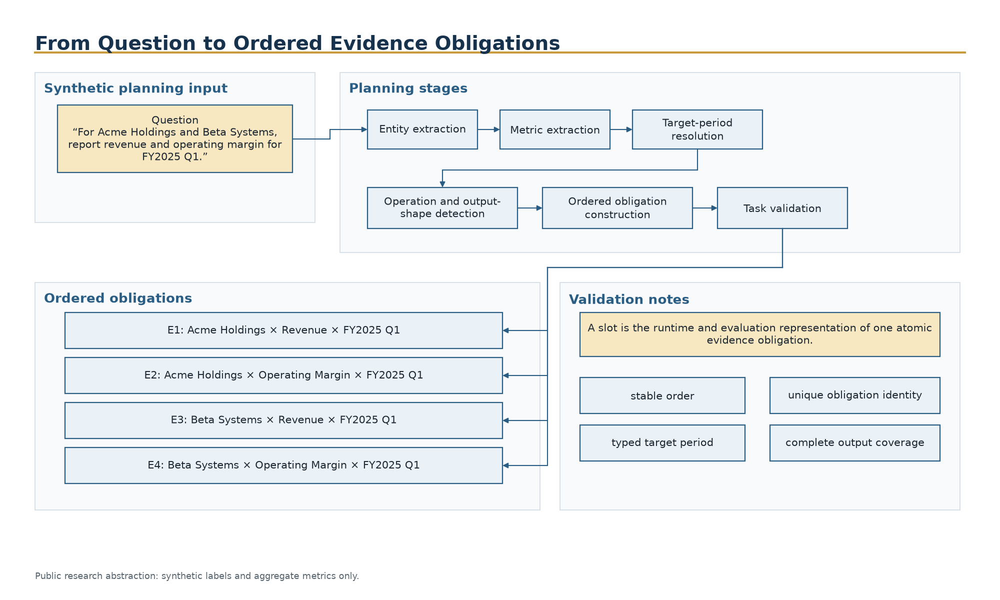
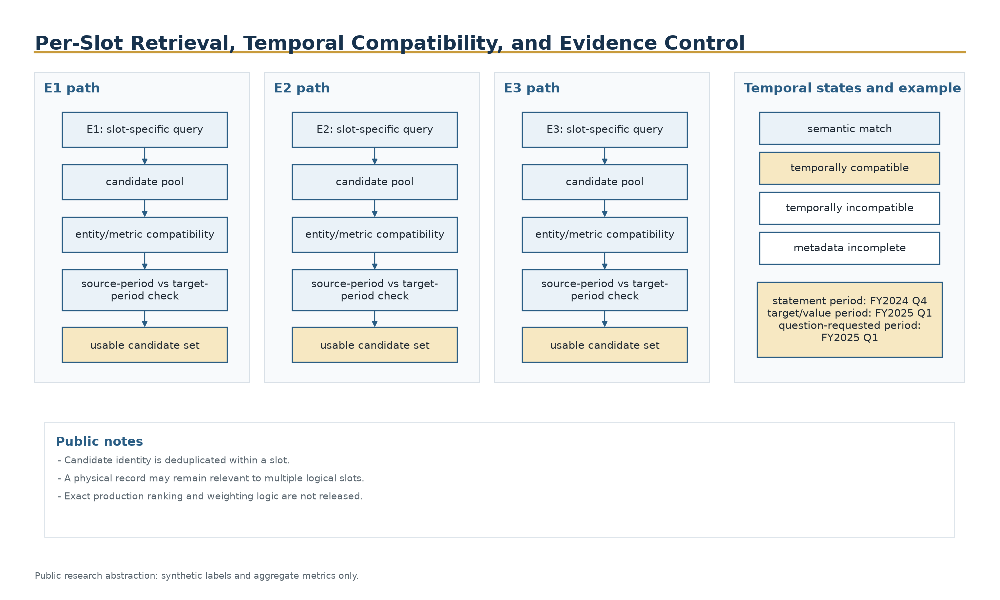
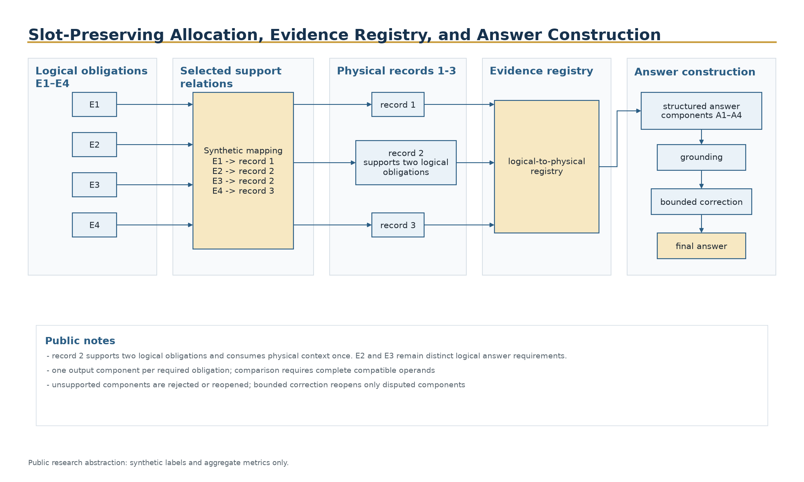
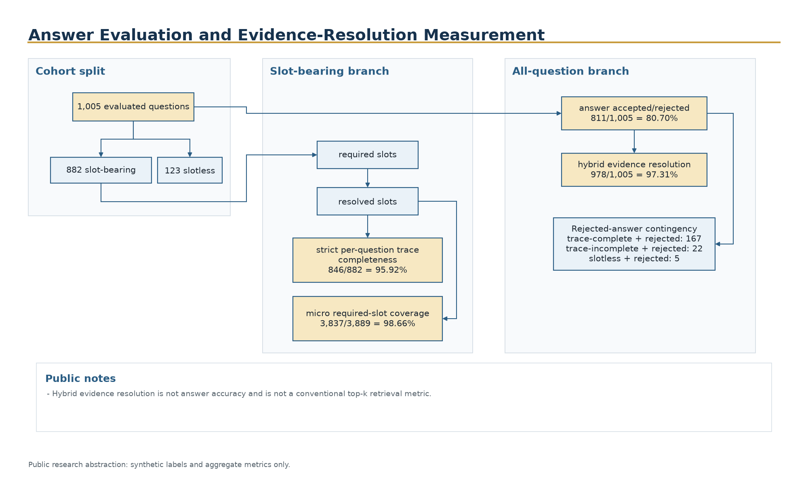

# Architecture

## Global flow


ChronoRAG-G represents each requested fact as an ordered evidence obligation and preserves that logical identity through retrieval, temporal control, allocation, answer construction, and evaluation.

```text
question
→ ordered evidence obligations
→ per-slot retrieval
→ compatibility and temporal control
→ slot-preserving allocation
→ logical-to-physical registry
→ structured answer
→ grounding and bounded correction
→ finalization
→ answer and trace evaluation
```

## 1. Planning and obligation construction

The planning stage converts the question into ordered atomic requirements. Each requirement contains the public information needed to identify one answer cell: entity, metric, requested period, temporal role, target type, and output position.

Malformed, duplicate, or incomplete obligations are rejected before retrieval.



Planning turns a synthetic question into stable ordered obligations with unique identity, typed target periods, and complete output coverage.

## 2. Per-slot retrieval

Every slot owns a candidate pool. The public abstraction allows deterministic candidate ordering and bounded pool growth without releasing production ranking constants or provider-specific behavior.

Candidates are deduplicated inside a slot. A physical record may remain relevant to several slots.

## 3. Compatibility and temporal control

Candidate compatibility is considered separately from semantic similarity. Publicly described checks include:

- entity compatibility;
- metric compatibility;
- target-period compatibility;
- statement-period versus target-period distinction;
- metadata completeness;
- value-type and unit compatibility.



Per-slot retrieval keeps candidate pools and temporal checks local to each obligation while permitting physical evidence to remain relevant across slots.

## 4. Slot-preserving allocation

Allocation chooses logical slot-candidate pairs while tracking which physical records are included. If one physical record supports two obligations, both logical relationships remain visible while the physical record is counted once against the context budget.

## 5. Logical-to-physical registry

The registry links:

```text
logical obligation
→ selected support relation
→ physical evidence record
```

This avoids both double charging and logical collapse.

## 6. Answer construction

The answer payload preserves the obligation order and selected support. Enumeration questions require one explicit output component per obligation. Comparison questions require complete and compatible operands before the comparison result is rendered.

## 7. Grounding and bounded correction

Grounding validates answer components against allowed evidence references and compatible metadata. When a component is disputed, bounded correction reopens only the affected obligations.



Allocation records logical-to-physical support relations so shared evidence does not collapse distinct answer requirements.

## 8. Finalization

Finalization derives the rendered answer from validated components. It does not invent values, silently convert incompatible units, or infer a comparison winner from incomplete evidence.

## 9. Evaluation flow

Answer acceptance, strict trace completeness, micro slot coverage, and hybrid evidence resolution remain separate. This separation exposes the difference between finding evidence and successfully rendering the final answer.



Evaluation reports answer accuracy separately from strict trace coverage, micro required-slot coverage, and hybrid evidence resolution.
